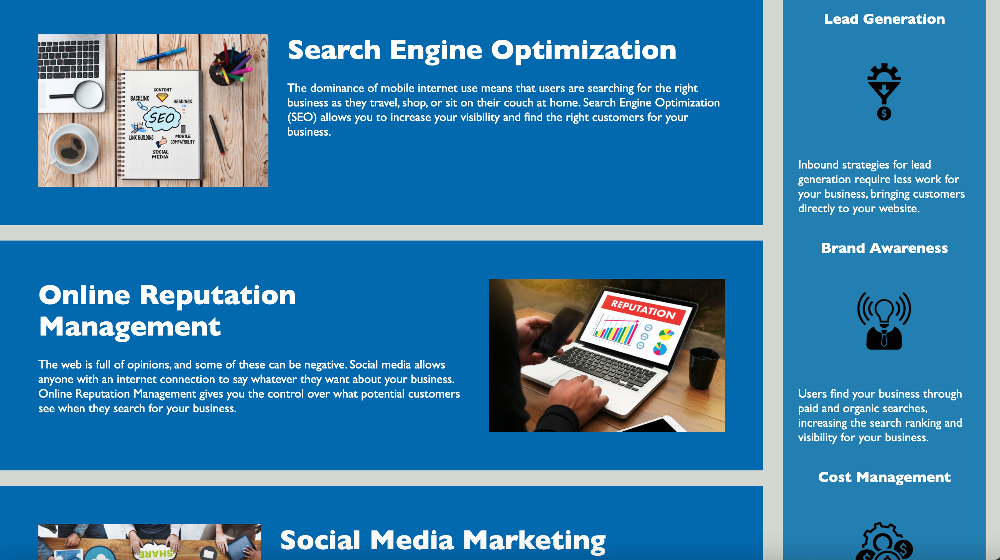

# Basic HTML Page
    
## Table of Contents
* [Description](#description) 
* [Installation](#installation)
* [Usage](#usage)
* [Credits](#credits)
* [License](#license)
* [Badge](#badge)
* [Questions](#questions)
    
## Description
* Simple HTML page using various HTML tags for building out website.
    
## Installation
* no installation necessary.  Use any up to date web browser to view web page
    
## Usage
* no instructions necessary.  Open any modeern web browser to view page and web site.

    
## Credits
* N/A
    
## License
* Licensed by mit
    
## Badge
* 
    
## Questions
* For any questions, concerns, or additional help, please contact klucas72@hotmail.com.